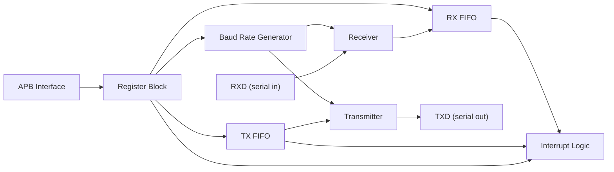
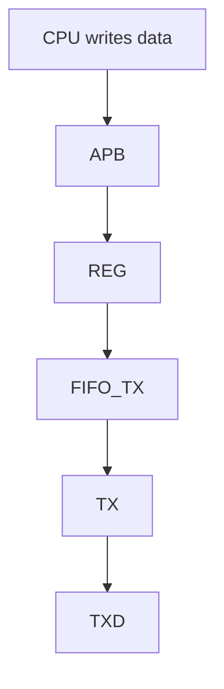
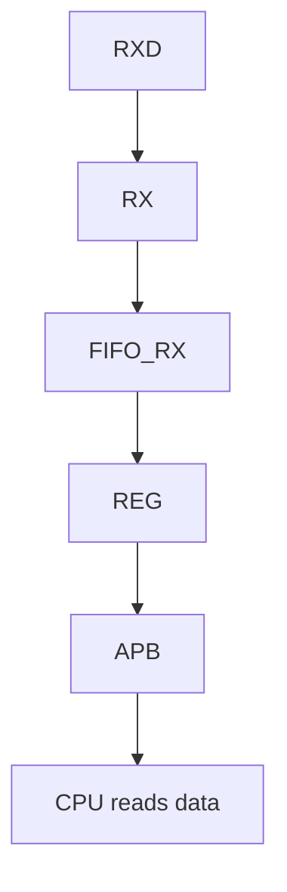
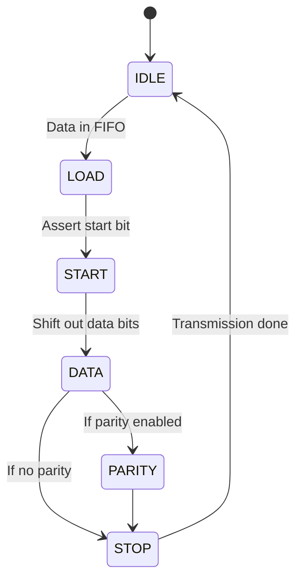
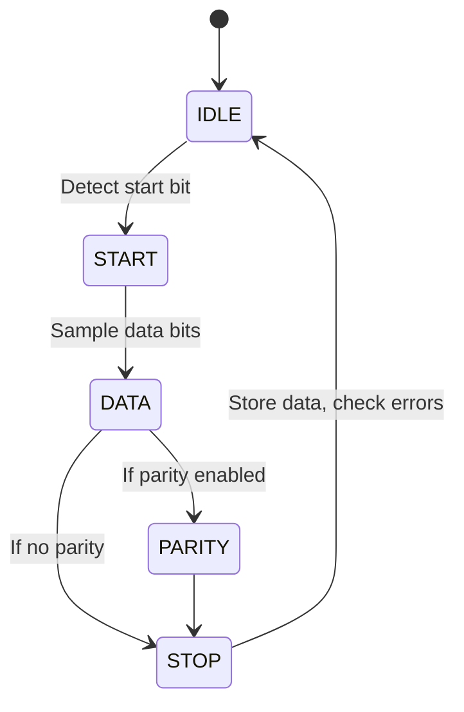
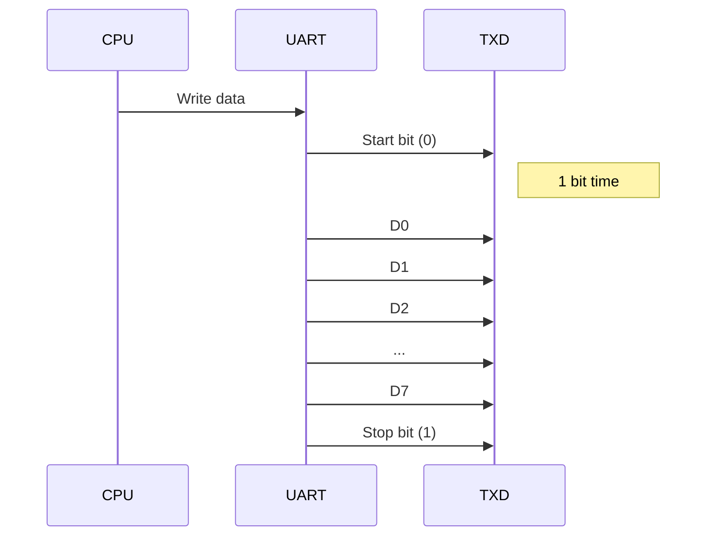
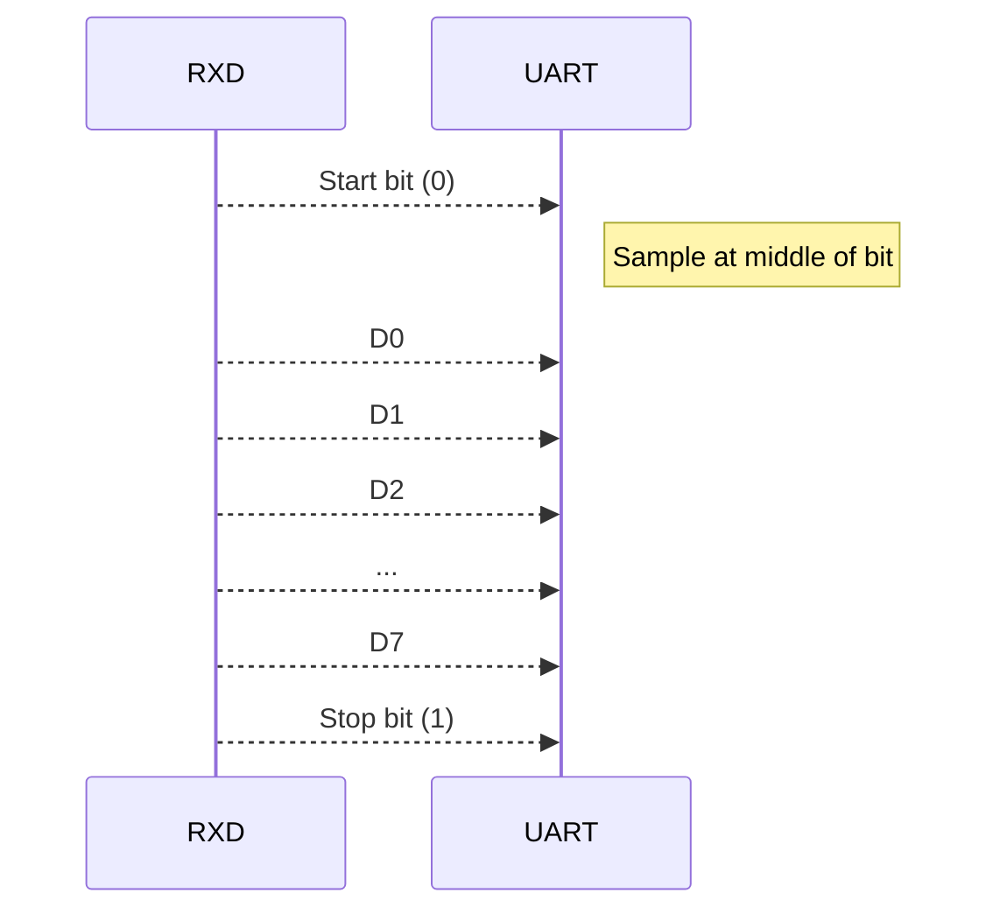

# UART IP Design Specification

## 1. Introduction

This document details the design specification for a Universal Asynchronous Receiver/Transmitter (UART) IP core, as per the Product Requirements Document (PRD). The UART IP provides a flexible, low-power, and area-efficient solution for serial communication, supporting programmable baud rates, FIFO buffering, and interrupt-driven operation. It features an APB interface for easy integration into SoC designs.

## 2. System Architecture

The UART IP consists of several key modules: APB Interface, Register Block, Baud Rate Generator, Transmit (TX) and Receive (RX) logic, FIFOs, and Interrupt Logic.

## 3. Module Descriptions

- **APB Interface**: Standard APB slave interface for register access (read/write, address decoding, ready/valid signaling).
- **Register Block**: Contains control, status, baud rate, FIFO level, and interrupt registers.
- **Baud Rate Generator**: Generates timing ticks for TX/RX based on programmable divisor.
- **Transmitter (TX)**: Serializes parallel data from TX FIFO, adds start/stop/parity bits, shifts out via TXD.
- **Receiver (RX)**: Deserializes incoming RXD data, checks framing/parity, writes to RX FIFO.
- **FIFO Buffers**: Configurable-depth FIFOs for TX and RX paths, status flags for full/empty/threshold.
- **Interrupt Logic**: Generates interrupts for RX data available, TX FIFO empty, FIFO overflow, framing/parity errors.

## 4. Data Path

### Transmit Path

### Receive Path

## 5. Control Path

- **Registers**:
    - Control Register: Enable, parity, stop bits, data bits, loopback, reset.
    - Status Register: TX/RX FIFO status, error flags.
    - Baud Rate Register: Programmable divisor.
    - Interrupt Enable/Status/Clear Registers.
- **Interrupt Handling**:
    - Interrupts are level or edge triggered.
    - Sources: RX FIFO threshold, TX FIFO empty, errors.
    - Cleared by writing to status/clear register or reading FIFOs.

## 6. State Machines

### TX FSM

### RX FSM

## 7. Timing Diagrams

### Transmit Bit Framing (8N1 example)

### Receive Bit Framing (8N1 example)

## 8. Reset and Boundary Conditions

- **Reset**: Synchronous active-high reset. All registers, FIFOs, FSMs reset to default. Outputs driven to idle.
- **Boundary Conditions**:
    - FIFO overflow/underflow handled with error flags.
    - Framing/parity errors flagged, data optionally discarded.
    - Handling for continuous 0/1 on RXD (break/idle detection).

## 9. Parameterization

- **Baud Rate**: Programmable via register, supports wide range (e.g., 300–1.5M).
- **FIFO Depth**: Configurable at synthesis (e.g., 4, 8, 16, 32).
- **Data Bits**: 5–8 bits selectable.
- **Parity**: None, Even, Odd.
- **Stop Bits**: 1 or 2.
- **APB Data Width**: 8/16/32-bit support.

## 10. Implementation Notes

- **Synthesis**: Fully synchronous, technology-independent RTL. CDC for RXD/TXD as needed.
- **Power**: Clock gating for unused modules, low toggle rates on APB.
- **Area**: FIFO depth and feature set are synthesis parameters.
- **Testability**: Scan-friendly, reset coverage, built-in loopback mode.

## 11. Verification Plan

- **Testbench**: UVM-based, APB BFM, random and directed tests.
- **Coverage**:
    - Functional: All register fields, FIFO levels, interrupts, errors.
    - Code: Statement, branch, FSM state coverage.
- **Corner Cases**: FIFO full/empty, RX noise, break, framing/parity errors.
- **Loopback**: Internal loopback mode for self-check.
- **Timing**: Baud rate accuracy, setup/hold on APB.
